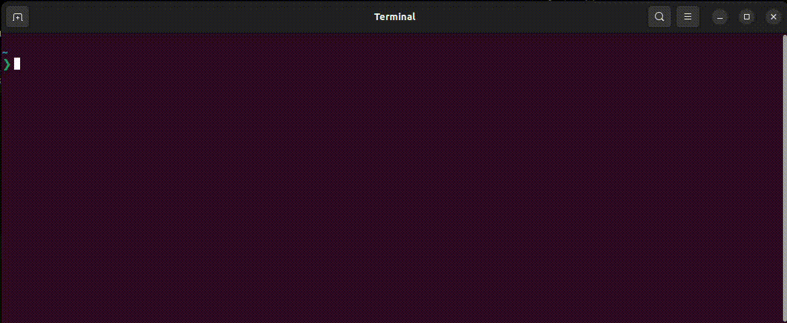

# gitcs

[](https://goreportcard.com/report/github.com/knbr13/gitcs)
[](https://github.com/avelino/awesome-go)  

Git Commits Visualizer (`gitcs` shortly) is a command-line tool that allows developers to analyze their local Git repositories and generate a visual contributions graph. This tool proves valuable for developers working across multiple Git services like GitHub and GitLab (because there are already graphs provided online by each of them, but each has it's own data, this tool works locally, so no matter where you've pushed the project, commits will count), enabling them to visualize contributions seamlessly, even in offline or disconnected environments.



## Dependencies

- Go
- Git

## Installation

Ensure that you have Go installed on your machine before installing this tool. Execute the following command:


```bash
  go install github.com/knbr13/gitcs@latest
```

Alternatively, if you don't have Go installed, download the latest release from this repository.

## Usage

The basic usage of this tool is to just run it, it will generate a graph of commits from the last 6 months.
```bash
> gitcs -path "/home/user/dev"
```

These commits are committed by your global Git email address, but you can also use the -email flag to show commits for another Git email.
```bash
> gitcs -email "email@example.com" -path "/home/user/dev"
```

By default, the tool displays commits from the last 6 months, but you can configure this using the `since` and `until` flags.
```bash
> gitcs -since "2023-10-24" -until "2024-01-15" -path "/home/user/dev"
```

- If no global Git email is set on your machine, then you have to specify it using the `-email` flag.
- The since and until flags don't need to be specified together.

## Contributions

Contributions are welcome! If you would like to contribute to this project, please follow these steps:

1- Fork the repository.

2- Create a new branch for your feature or bug fix.

3- Make the necessary changes and commit them.

4- Push your changes to your fork.

5- Submit a pull request describing your changes.

## License

This project is licensed under the [MIT License](https://github.com/knbr13/gitcs/blob/main/LICENSE). See the [LICENSE](https://github.com/knbr13/gitcs/blob/main/LICENSE) file for details.
