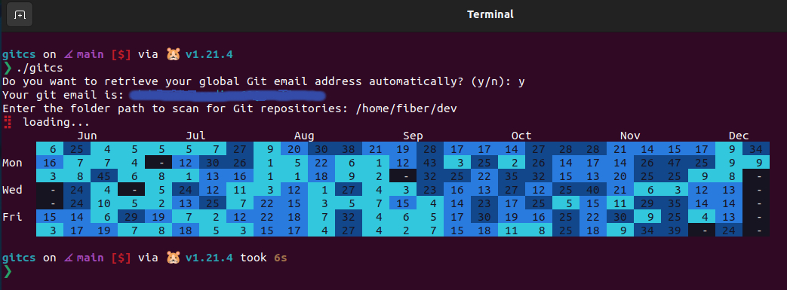

# gitcs

Git Commits Visualizer, a command-line tool written in Go that enables developers to scan their local Git repositories and generate a visual contributions graph. This tool is useful for developers who work with multiple Git services, such as GitHub and GitLab. It allows them to visualize their contributions across both platforms, even in offline or disconnected environments.

## Screenshots



## Installation

To install this tool, ensure that you have Go installed on your machine. Then, execute the following command:

```bash
  go install github.com/abdullah-alaadine/gitcs@latest
```

Or if you don't have Go installed, download the latest release found in this repository.

## Contributions

Contributions are welcome! If you would like to contribute to this project, please follow these steps:

1- Fork the repository.

2- Create a new branch for your feature or bug fix.

3- Make the necessary changes and commit them.

4- Push your changes to your fork.

5- Submit a pull request describing your changes.

## License

This project is licensed under the [MIT License](https://github.com/abdullah-alaadine/gitcs/blob/main/LICENSE). See the [LICENSE](https://github.com/abdullah-alaadine/gitcs/blob/main/LICENSE) file for details.
