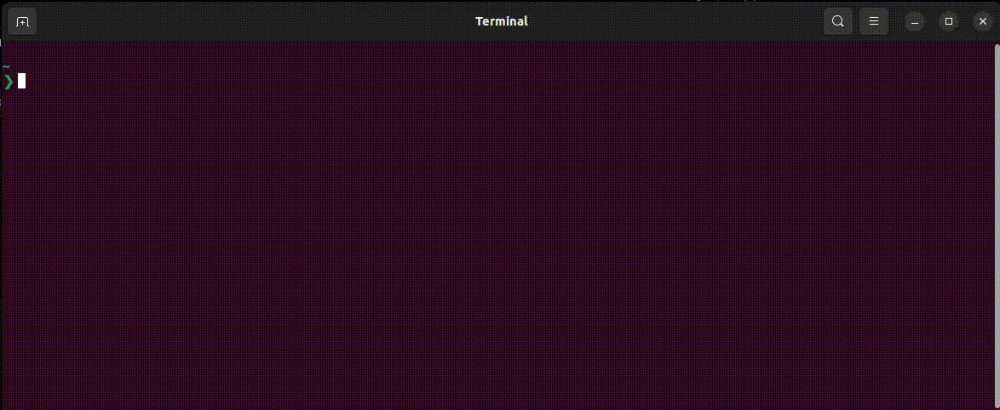

# gitcs

[](https://github.com/avelino/awesome-go)  

Git Commits Visualizer (`gitcs` shortly) is a command-line tool that allows developers to analyze their local Git repositories and generate a visual contributions graph. This tool proves valuable for developers working across multiple Git services like GitHub and GitLab (because there are already graphs provided online by each of them, but each has it's own data, this tool works locally, so no matter where you've pushed the project, commits will count), enabling them to visualize contributions seamlessly, even in offline or disconnected environments.



## Installation

Ensure that you have Go installed on your machine before installing this tool. Execute the following command:


```bash
  go install github.com/hrtsegv/gitcs@latest
```

Alternatively, if you don't have Go installed, download the latest release from this repository.

## Usage

### Live repository map

Build the browser UI once during development, then start the local map:

```bash
cd frontend && npm install && npm run build
cd ..
go run . map
```

The map is served only on `127.0.0.1:7331`. Release builds produced by
`make build` embed the browser UI, so Node is not required on the machine
running `gitcs`. The browser UI has three live views: what is changing right
now, every source-code connection, and the whole graph with changes
highlighted.

#### Supported languages

`gitcs map` draws connections for:

| Language | What it reads |
| --- | --- |
| Go | Top-level function definitions and calls between files |
| JavaScript / TypeScript | `import`, `export ... from`, `import()`, `require()` — including `.jsx`, `.tsx`, `.mjs`, `.cjs` |
| Svelte / Vue | Imports inside `<script>` blocks |
| Rust | `mod` declarations and `use` paths, across a Cargo workspace |

Module resolution follows each ecosystem's own rules, so it works on real
projects rather than only tidy ones: extensionless imports and directory
`index` files resolve, TypeScript's `./thing.js`-means-`thing.ts` convention is
understood, and `tsconfig.json`/`jsconfig.json` path aliases (`@/components/…`)
are read. Every directory with a `package.json` or `tsconfig.json` counts as its
own project, so nested clients and monorepo packages each get their own aliases
and entry points.

Imports of published packages produce no connection — only files that are
actually in the repository become nodes. Files in other languages still appear
on the map with their Git history; they simply have no connections drawn.

The basic usage of this tool is to just run it, it will generate a graph of commits from the last 6 months.
```bash
> gitcs -path "/home/user/dev"
```

These commits are committed by your global Git email address, but you can also use the -email flag to show commits for another Git email.
```bash
> gitcs -email "email@example.com" -path "/home/user/dev"
```

If you want to include commits from **all** authors (regardless of email), pass a wildcard:
```bash
> gitcs -email "*" -path "/home/user/dev"
```

If you want to see how the total work progressed over time, add the `-progress` flag:
```bash
> gitcs -path "/home/user/dev" -progress
```

If you want a weekly bar chart of commit history, add the `-bars` flag:
```bash
> gitcs -path "/home/user/dev" -bars
```

By default, the tool displays commits from the last 6 months, but you can configure this using the `since` and `until` flags.
```bash
> gitcs -since "2023-10-24" -until "2024-01-15" -path "/home/user/dev"
```

- If no global Git email is set on your machine, then you have to specify it using the `-email` flag.
- The since and until flags don't need to be specified together.

## Contributions

Contributions are welcome! If you would like to contribute to this project, please follow these steps:

1- Fork the repository.

2- Create a new branch for your feature or bug fix.

3- Make the necessary changes and commit them.

4- Push your changes to your fork.

5- Submit a pull request describing your changes.

## License

This project is licensed under the [MIT License](https://github.com/hrtsegv/gitcs/blob/main/LICENSE). See the [LICENSE](https://github.com/hrtsegv/gitcs/blob/main/LICENSE) file for details.
